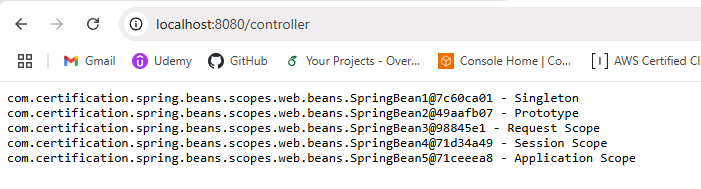
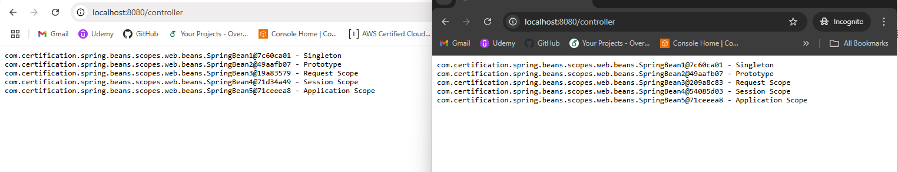
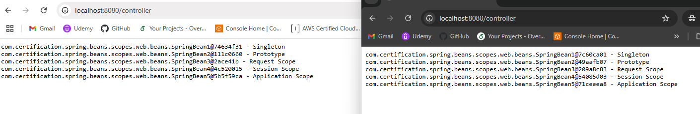

SpringBeans scope:

1. singleton: Only one spring bean instance per IoC container - default
2. prototype: New instance each time the bean is requested -  @Scope("prototype")
3. request: New instance per each HTTP request - @RequestScope
4. session: New instance per each HTTP session - @SessionScope
5. application: One instance per each context - @ApplicationScope
6. websocket: One instance per each websocket connection

Request scope

Session scope

Application scope
